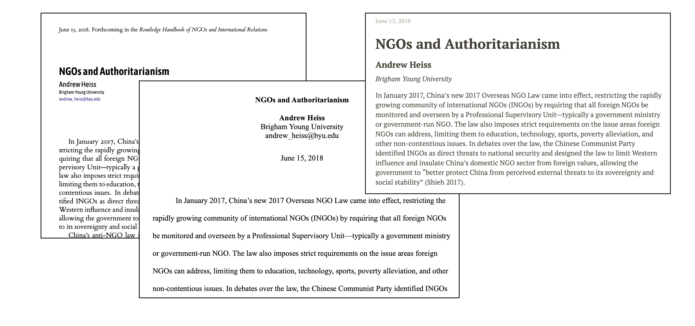

```{css, echo=FALSE}
.section h2 {
    padding-top: 94px;
    margin-top: -71px;
}

.title {
    display: none
}
```

<div class="row" style="padding-top: 30px;">
<div class="col-sm-6">

# **Universal documents and reproducibility**

**Andrew Heiss**  
Andrew Young School of Policy Studies • Georgia State University  
[andrewheiss.com](https://www.andrewheiss.com) • [\@andrewheiss](https://twitter.com/andrewheiss)

---

<small>Unpacking the Hidden Curriculum  
Graduate Student Professionalization Workshop  
Department of Political Science • University of Utah  
October 23, 2020</small>

---

Welcome to this workshop on Markdown and reproducibility!

Use the top menu to see different resources and guides.

Download materials to play along with here:

<p><a class="btn btn-info btn-lg" target="_blank" href="markdown-playground.zip"><i class="fas fa-external-link-alt"></i> markdown-playground.zip</a></p>

You can view and download [the Markdown source for this whole website at GitHub](https://github.com/andrewheiss/2020-10-23_utah-markdown).

</div>

<div class="col-sm-6">

```{r echo=FALSE}
knitr::include_graphics("slides/img/md-to-everything.png")
```

```{r echo=FALSE}

```

</div>
</div>
